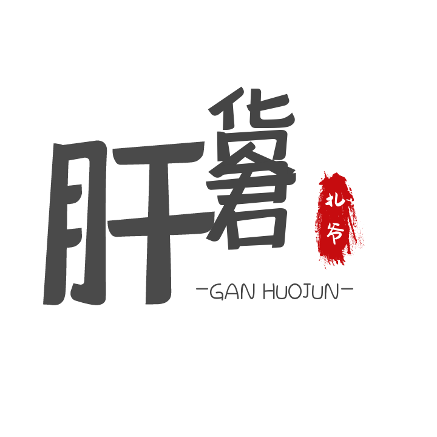
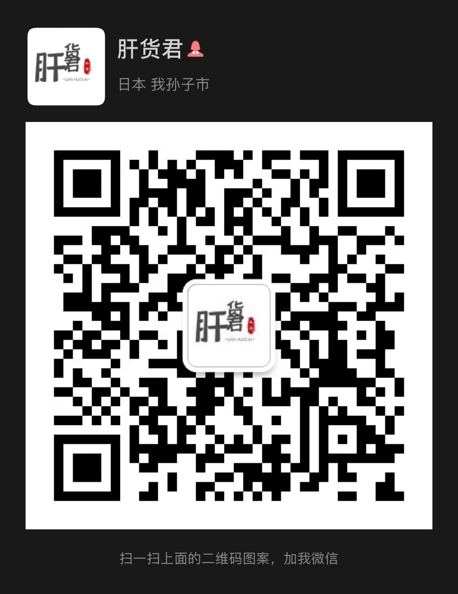

# GANHUO
本人从事前端相关工作，虽然不是什么有名的大佬，但也有自己擅长的领域，为各位伙伴少走弯路贡献出自己的绵薄之力，将会分享出自己的肝货笔记，不定期更新，若有想要了解的肝货可以提issues或者联系我。

<p align="center">
  
</p>

<p align="center">
  <a href="#微信"></a>
</p>

# 微信
<p align="center">
  
</p>

## 目录
```
GANHUO
.
├── README.md
├── 素材
│   ├── README.md
│   └── 图片
│       ├── iterm2ohmyzsh.png
│       ├── logo.png
│       ├── vscode.png
│       ├── wechat.jpeg
│       └── wechat.svg
├── 工具篇
│   └── README.md
├── 应用篇
│   └── README.md
└── 算法篇
    ├── README.md
    └── leetcode66.md
```
