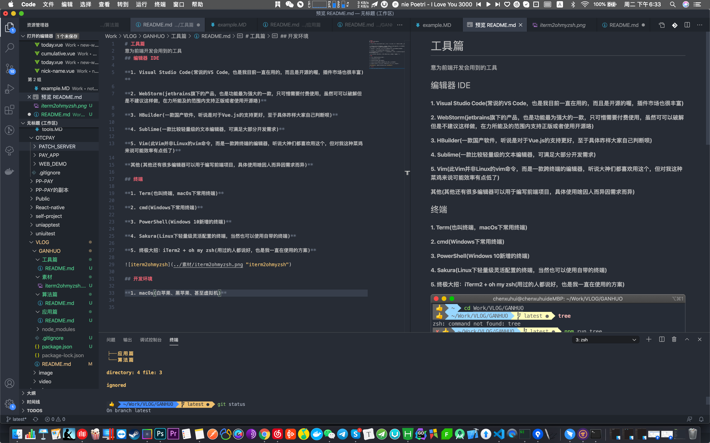
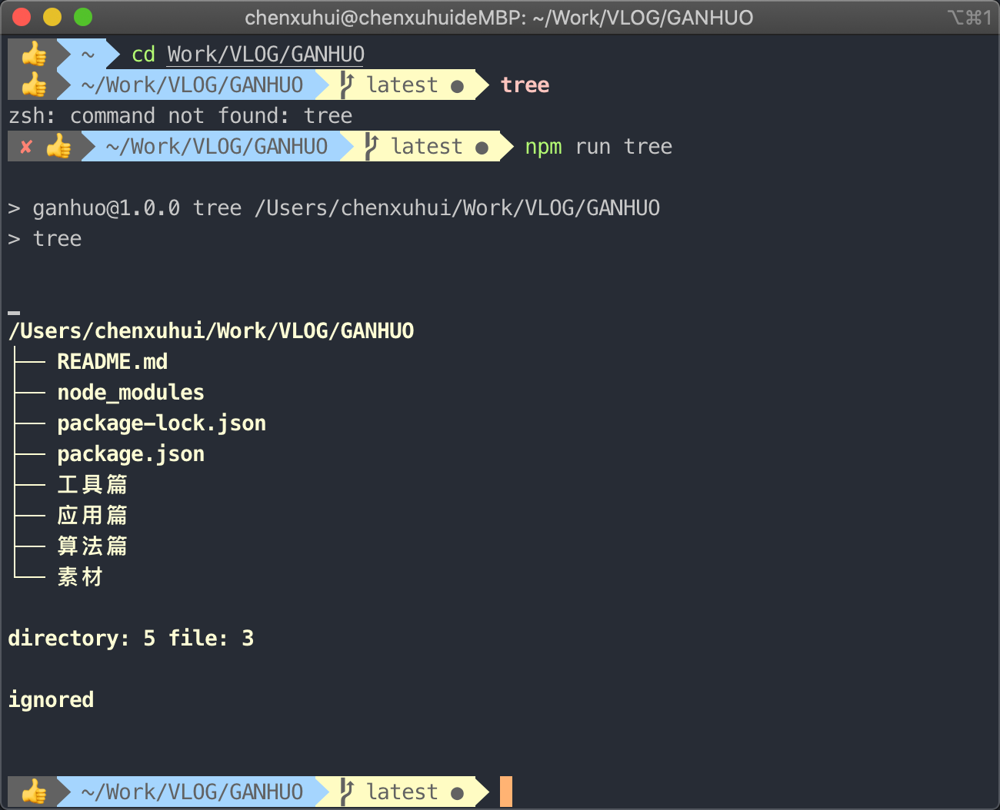

# 工具篇
意为前端开发会用到的工具，工欲善其事，必先利其器，文中提到的内容如果想要了解具体的安装或者配置使用可以提issues或者私聊我哦，我也会不定时出一些教程
## 编辑器 IDE

**1. Visual Studio Code(常说的VS Code，也是我目前一直在用的，而且是开源的喔，插件市场也很丰富)**

  

**2. WebStorm(jetbrains旗下的产品，也是功能最为强大的一款，只可惜需要付费使用，虽然可以破解但是不建议这样做，在力所能及的范围内支持正版或者使用开源咯)**

**3. HBuilder(一款国产软件，听说是对于Vue.js的支持更好，至于具体咋样大家自己判断呗)**

**4. Sublime(一款比较轻量级的文本编辑器，可满足大部分开发需求)**

**5. Vim(此Vim并非Linux的vim命令，而是一款跨终端的编辑器，听说大神们都喜欢用这个，但对我这种菜鸡来说可能效率有点低了)**

**其他(其他还有很多编辑器可以用于编写前端项目，具体使用啥因人而异因需求而异)**

## 终端

**1. Term(也叫终端，macOs下常用终端)**

**2. cmd(Windows下常用终端)**

**3. PowerShell(Windows 10新增的终端)**

**4. Sakura(Linux下轻量级灵活配置的终端，当然也可以使用自带的终端)**

**5. 终极大招：iTerm2 + oh my zsh(用过的人都说好，也是我一直在使用的方案)**

  

## 开发环境

**1. macOs(白苹果、黑苹果、甚至虚拟机)**

**2. Linux(当然是桌面发行版啦，可不是那个黑乎乎的命令行界面，Ubuntu、Manjaro、Arch Linux等等)**

**3. Windows(用户基数最大，软件生态比较齐全)**

**总结. 对于我个人来说macOs跟Linux开发环境比较稳定，相对于Windows的环境配置略微简单且问题较少(并不是偏心喔，仅仅是个人看法)**

## 工作沟通工具

**1. 钉钉(国内的伙伴应该大部分用的这个，阿里出品，工作必备)**

**2. Skype(还有一款企业版Skype business，个人感觉不太友好，体验不是很好)**

**3. Telegram(一款基于区块链技术的通讯软件，聊天信息加密等...由于本人工作特殊性，投靠他的怀抱)**

**4. Potato Chat(几乎复刻了Telegram的所有功能，与其最大区别应该就是在国内也有很好的访问性，据我所知在国内也有一些团队会使用它)**

## 周边工具

**1. Snipaste(跨终端的轻量级截图软件)**

**2. ColorSlurp(macOs上非常好用的轻量级取色器)**

**3. Postman(这个不用多说，不管是前后端开发还是测试的伙伴都在用)**

**4. Docker(详细的描述大家可以维基百科、百度百科上查询，我常用于自动化部署)**

**5. Sourcetree(可视化git管理工具，以前我也只敲命令管理git仓库，用了之后我连命令都记不住了)**

**6. 音乐播放器(给枯燥的二进制世界添加一些调剂)**

## 科学上网(切勿商用、谨慎分享)

**1. ShadowsocksR(简称ssr,辈分比较高，作者也已经被请走喝茶，常搭配bbr加速或是锐速以及其他加速方式，客户端支持比较好，几乎涵盖各个终端)**

**2. V2ray(继Shadowsocks之后新出现的一种开源技术，任何开发者都能在其基础上开发出新的代理工具，配置相较于ssr稍微复杂，客户端支持程度一般，但够用)**

**3. Brook、WireGuard(新一代科学上网，我没有使用过，大家感兴趣的可以自己研究一下喔)**

**4. Trojan(新一代科学上网，与传统科学上网最大的区别就是不采用强加密和随机模糊，而是采用模https来达到设计目的，所以需要搭配域名跟SSL)**

**5. 软路由 + 以上任意科学上网(一键解决跨终端科学上网)**

**总结. 科学上网虽好，但不要贪杯，油管跟一些数据传输量大的使用场景还是很容易被封ip，我目前常用的还是ssr跟trojan，一个是使用场景广泛适用我多终端使用，一个比较稳定可以满足我经常检索资料**

